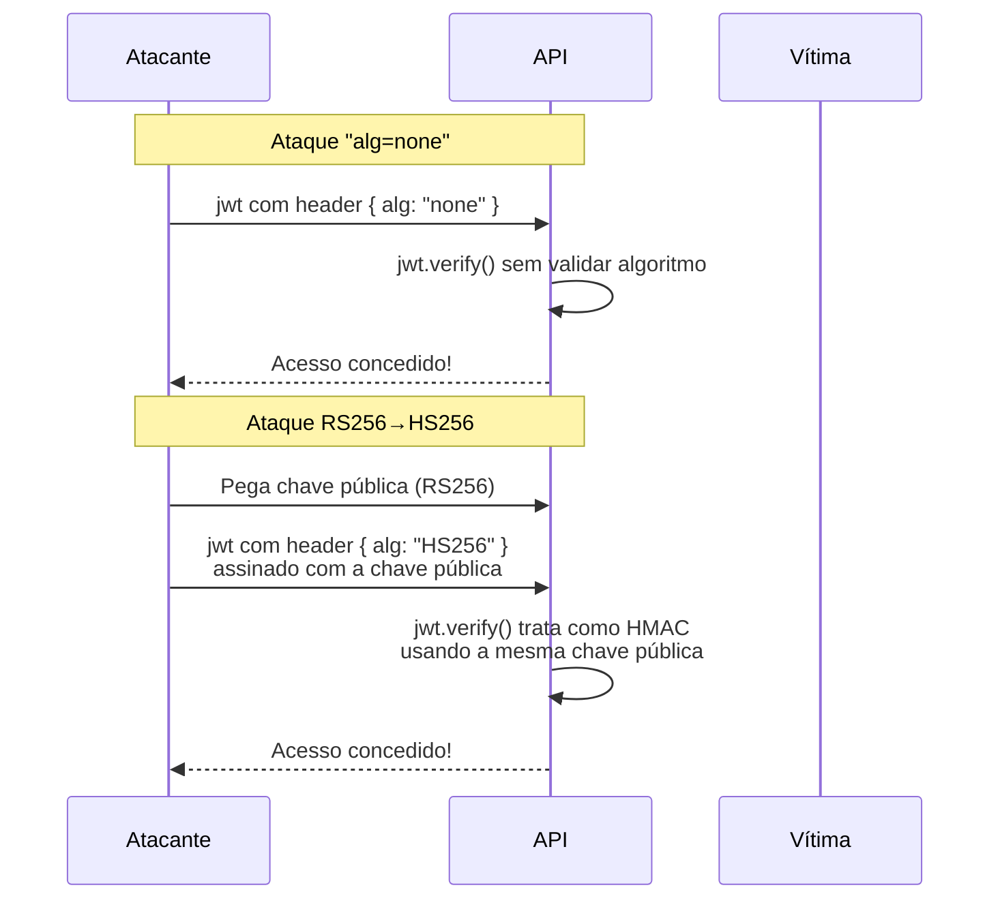
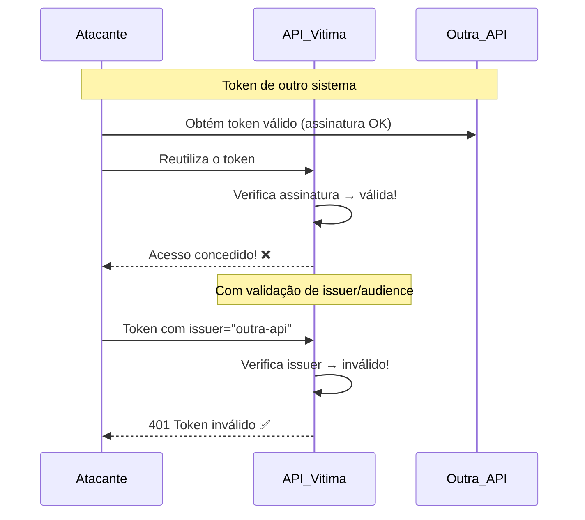
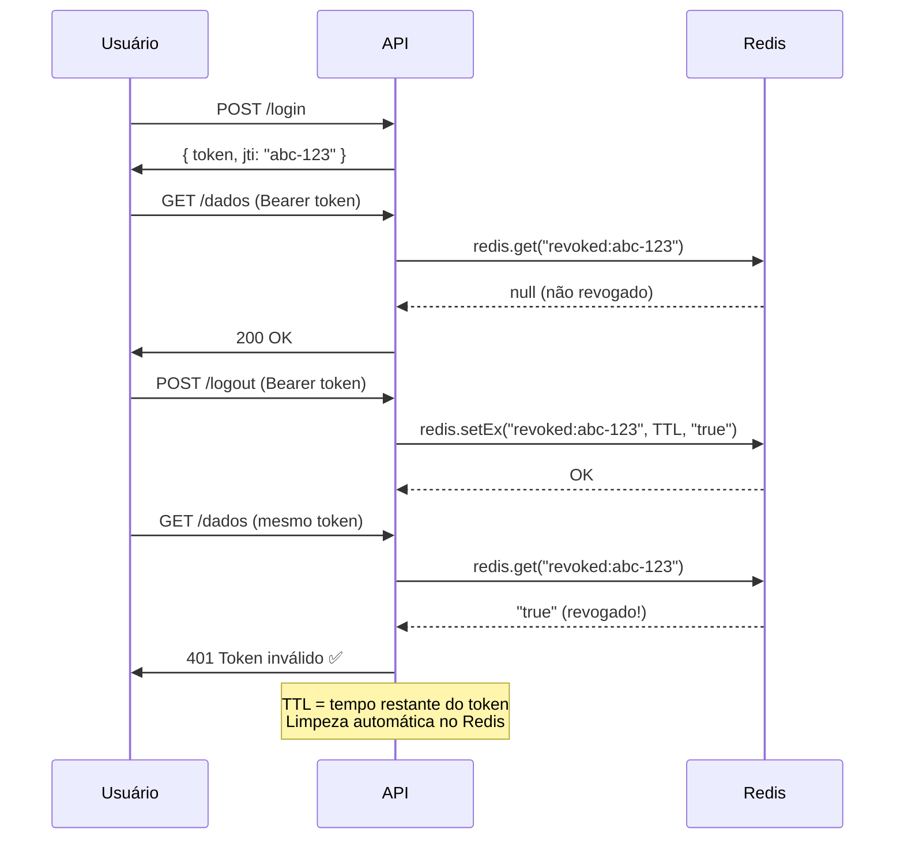
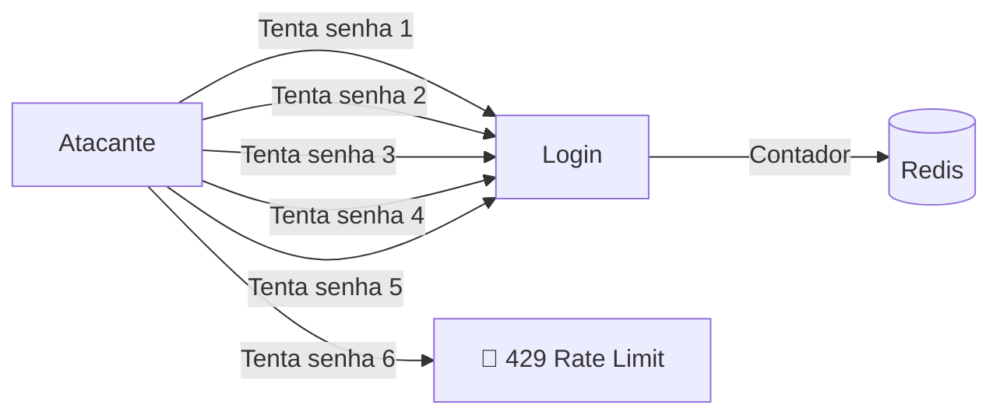
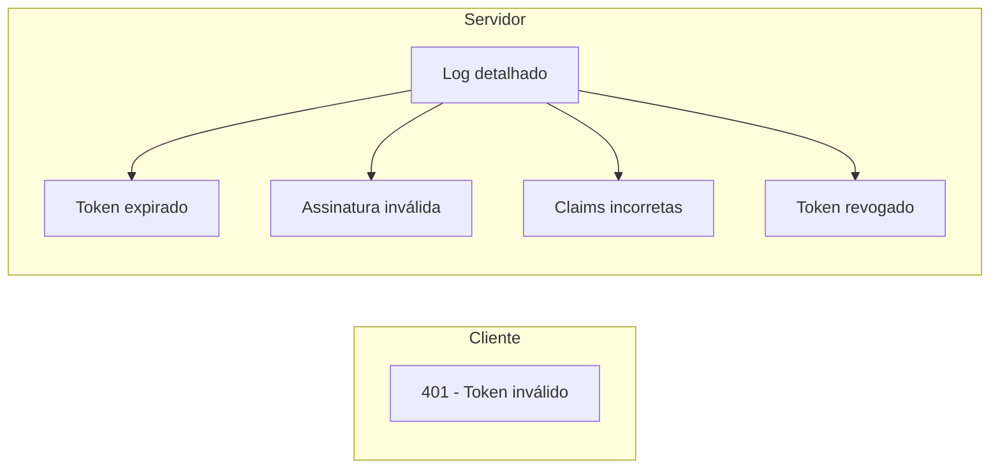

# Resumo: 7 Falhas de Segurança em Middlewares JWT

> Fonte: [LinkedIn - Lucas Albuquerque](https://www.linkedin.com/posts/lucasalbuquerquecode_a-maioria-dos-middlewares-de-jwt-que-vejo-share-7473321266813440000-CSrj/)

---

## O Problema

A maioria dos middlewares JWT em produção tem **pelo menos uma falha grave de segurança**. A implementação básica — extrair token do header, verificar assinatura, seguir em frente — é insuficiente para cenários reais.

```javascript
// Implementação básica — vulnerável
function authMiddleware(req, res, next) {
  const token = req.headers.authorization?.split(' ')[1];
  if (!token) return res.status(401).json({error: 'no token'});
  try {
    req.user = jwt.verify(token, SECRET);
    next();
  } catch {
    res.status(401).json({error: 'invalid token'});
  }
}
```

---

## As 7 Boas Práticas

### 1. Algoritmo explícito na verificação

```javascript
jwt.verify(token, SECRET, { algorithms: ['HS256'] });
```

**Ataque evitado — Algorithm Confusion:**



Sem especificar `algorithms`, a biblioteca aceita `alg: "none"` ou permite troca de RS256 para HS256, explorando confusão entre chave pública e simétrica.

---

### 2. Validação de claims obrigatórias

```javascript
jwt.verify(token, SECRET, {
  algorithms: ['HS256'],
  issuer: 'minha-api',
  audience: 'meu-app'
});
```

**Ataque evitado — Scope Injection:**



Token válido emitido para **outro propósito** (outra API, redefinição de senha, admin panel) não deve ser aceito.

---

### 3. Access token curto + Refresh token

| Token          | Duração       | Armazenamento        |
|----------------|---------------|----------------------|
| Access token   | 15 minutos    | Memória do cliente   |
| Refresh token  | Dias/semanas  | httpOnly cookie      |

**Motivo:** Se o access token vazar, a janela de exposição é de apenas 15 minutos. O refresh token, protegido em cookie httpOnly, não é acessível via JavaScript.

---

### 4. Blacklist de token revogado (JTI)

```javascript
const isRevoked = await redis.get(`revoked:${decoded.jti}`);
```



O **JTI (JWT ID)** é um UUID único gerado no login. No logout (ou comprometimento), o JTI é armazenado no Redis com TTL igual ao tempo restante de expiração do token.

---

### 5. Rate limit no endpoint de login

```
5 tentativas / minuto / IP
5 tentativas / minuto / usuário
```



Sem rate limit, ataque de brute force é trivial.

---

### 6. Erro genérico pro cliente, log detalhado pro time

```
Cliente recebe:     "Token inválido ou expirado"
Log interno salva:  "[AUTH ERROR] jwt issuer invalid. expected: lab-api, received: outra-api"
```



Nunca vaze **qual** foi o motivo exato da falha para o cliente — isso dá informações valiosas para o atacante.

---

### 7. Secret forte em Secrets Manager

- ❌ Nunca no código fonte
- ❌ Nunca no `.env` commitado
- ❌ Sem rotação periódica
- ✅ Usar AWS Secrets Manager / HashiCorp Vault / variável de ambiente segura
- ✅ Rotação periódica da chave

---

## Comparação: Middleware Inseguro vs Seguro

| Prática                          | Inseguro | Seguro |
|----------------------------------|:--------:|:------:|
| Algoritmo explícito              | ❌       | ✅     |
| Validação de issuer/audience      | ❌       | ✅     |
| Access token curto (15 min)      | ❌       | ✅     |
| Blacklist de revogação (Redis)   | ❌       | ✅     |
| Rate limit no login              | ❌       | ✅     |
| Erro genérico + log detalhado    | ❌       | ✅     |
| Secret externa e rotacionável    | ❌       | ✅     |

---

## Conclusão

> **JWT mal implementado é a porta de entrada mais comum pra comprometer uma API.**

As 7 práticas acima transformam um middleware básico em uma barreira de defesa sólida. A diferença entre um JWT "funcionando" e um JWT **seguro** está nos detalhes que a maioria ignora até levar um ataque.
